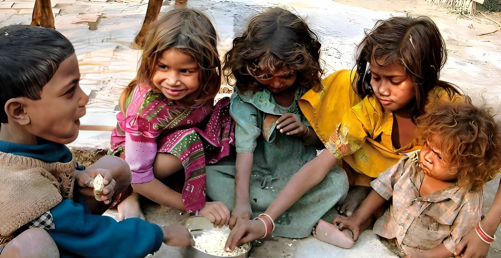
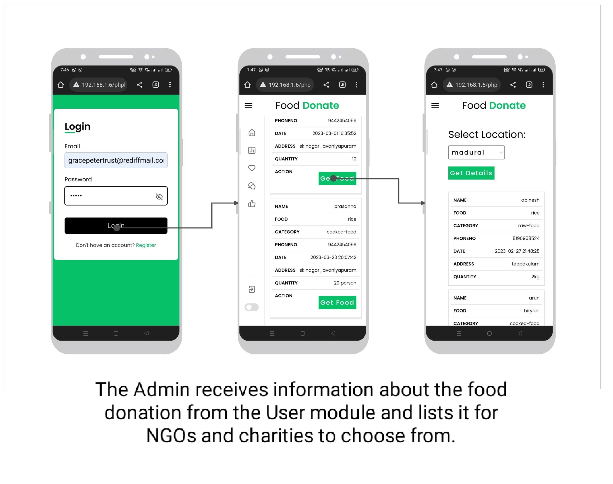
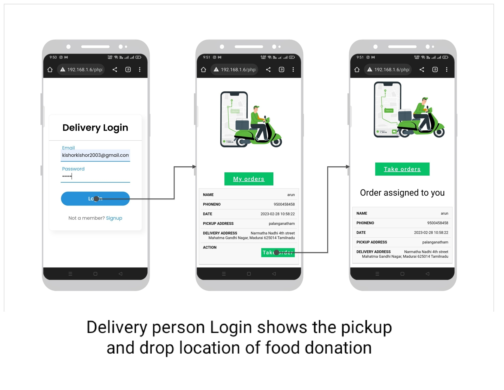
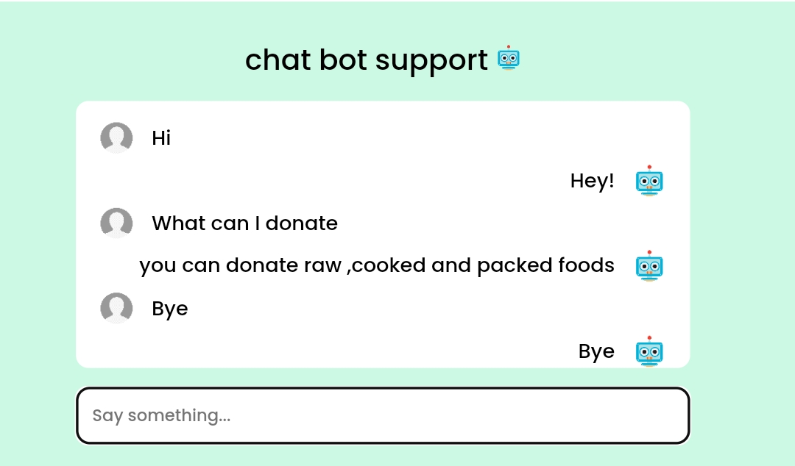
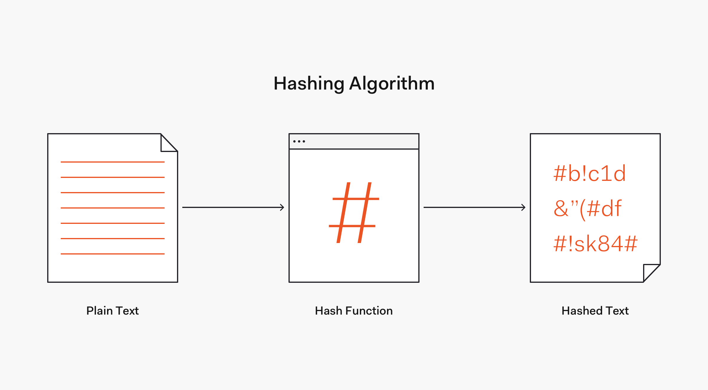

# Food waste management system
<!--  -->

  The basic concept of this project  Food Waste Management is to collect theexcess/leftover food from donors such as hotels, restaurants, marriage halls, etc and distribute to  the  needy people .

<h2>Tools and Technologies</h2> 
<ul>
 <li>Frontend : HTML, CSS,  JavaScript</li>
 <li>Backend  : php</li>
 <li>webserver: xampp server</li>
 <li>Database: MySQL </li>
</ul>

 <h2>The system has three modules. </h2>
    <ul><li>User</li>
    <li>Admin</li>
    <li>Delivery</li></ul>
    
    
The User module is designed for people who wish to donate their excess or leftover food to help reduce food wastage.The User module is responsible for accepting food donations from users who have excess food, such as marriage halls, restaurants, or individuals.The module provides users with the ability to register, login, and donate food. Users can select the type and quantity of food they want to donate, and the system will match their donation with the nearest needy people or organizations.The module also allows users to view their donations.The User module provides the information to the Admin module for further processing.
   
 
   

      The Administrator module is for trusts, NGOs, and charities that are registered on the platform. The Admin module is designed for system administrators who manage the food distribution process. The Admin module receives information about the food donation from the User module and lists it for NGOs and charities to choose from.Admins can view and manage the list of donations received, including the type and quantity of food donated. NGOs and charities can select the food donation they need from the Admin module and request a pickup to the Delivery module.The Admin module is responsible for tracking the requests and keeping track of which organizations have taken which donations
   
 
    
The Delivery Person module is for individuals who wish to participate in the food donation process by providing pickup and delivery services. Delivery personnel can register themselves on the platform .The Delivery Person module provides pickup and drop-off services for NGOs and charities who have requested a food donation.The Delivery Person module shows the pickup location and drop location of the food donation.
    
 
    
Overall, the Food Waste Management System is designed to efficiently manage excess food and ensure that it is distributed to those in need. The User module accepts food donations, the Admin module lists them for NGOs and charities to choose from, and the Delivery Person module provides pickup and drop-off services. This system benefits the community by reducing food waste and helping those in need
    

    <h3>User </h3>
   <!--  -->
    
    <h3>Admin </h3>
    
     <h3>Delivery </h3>
    
    <h3>features:</h3>
    <ul><li>Mobile Screen friendly website.</li>
      <li>chatbot support</li>
      <li>Secure Login</li>
      </ul>
      <h2>Mobile Screen friendly website.</h2>
      
      <h2>chatbot support</h2>
      
      <h2>Secure Login</h2>
      
      <h2>How to run</h2>
      <ol>
       <li>Download the project zip file</li>
       <li> Extract the file and copy the folder</li>
       <li>Paste inside root directory(for xampp xampp/htdocs, for wamp wamp/www, for lamp var/www/Html)</li>
       <li> Open PHPMyAdmin (http://localhost/phpmyadmin)</li>
       <li> Create a database</li>
       <li>Import demo.sql file(inside database folder)</li>
       <li> Run the script http://localhost/folderName </li> </ol>

<h2>view project :</h2>

<a href="https://kishor-23.github.io/food-donate/index.html" > view demo</a>

